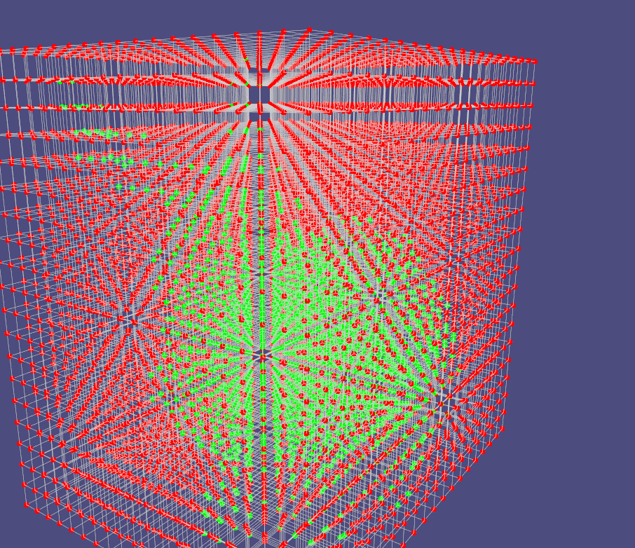

# Reconstruction-Mesh-Model-From-Point-Cloud-Demo
A demo in C++ can reconstruciotn mesh model from point cloud. Relying on libigl.

**!!!Warning!!! : This demo rely on libigl. You have to set up your libigl lib in the external folder to build this project.**

## 1. Setting up the Constraints

### 1.1 Creating the constraints

For all input points, just let their coordinates add or minus an epsilon weight of their normal vector, then get the constraints points.

```cpp
void createConstrainedPoints() {
    // get epsilon
    Eigen::Vector3d m = P.colwise().minCoeff();
    Eigen::Vector3d M = P.colwise().maxCoeff();
    Eigen::Vector3d difference = M - m;
    double epsilon = difference.norm() * 0.01;

    // set constrained values
    constrained_values = Eigen::VectorXd(P.rows() * 3);
    for (int i = 0; i < P.rows(); i++) {
        constrained_values(i) = 0;
        constrained_values(i + P.rows()) = epsilon;
        constrained_values(i + P.rows() * 2) = -epsilon;
    }

    // set constrained points and their color
    constrained_points = Eigen::MatrixXd(P.rows() * 3, P.cols());
    constrained_color = Eigen::MatrixXd(P.rows() * 3, P.cols());
    for (int i = 0; i < P.rows(); i++) {
        // GREEN
        constrained_points.row(i)                   = P.row(i);
        constrained_color.row(i)                    = Eigen::Vector3d(0.0, 1.0, 0.0);
        // RED
        constrained_points.row(i + P.rows())        = P.row(i) + epsilon * N.row(i);
        constrained_color.row(i + P.rows())         = Eigen::Vector3d(1.0, 0.0, 0.0);
        // BLUE
        constrained_points.row(i + P.rows() * 2)    = P.row(i) - epsilon * N.row(i);
        constrained_color.row(i + P.rows() * 2)     = Eigen::Vector3d(0.0, 0.0, 1.0);
    }
};
```


### 1.2 Implementing a spatial index to accelerate neighbor calculations

Firstly, part the whole space into different spatial partitions with spatial index. Then, while querying, just retrieve the points in neighbor partitions to decrease the amount of computation. The neighbor partitions can got by calculating the different of index.

```cpp
void spatialIndexInit(int resolution1D = 10)
{
    int numOfPartition = resolution1D * resolution1D * resolution1D;

    // Grid bounds: axis-aligned bounding box
    Eigen::RowVector3d bb_min, bb_max;
    bb_min = P.colwise().minCoeff();
    bb_max = P.colwise().maxCoeff();

    // Bounding box dimensions
    Eigen::RowVector3d dim = bb_max - bb_min;

    // Grid spacing
    const double dx = dim[0] / (double)(resolution1D - 1);
    const double dy = dim[1] / (double)(resolution1D - 1);
    const double dz = dim[2] / (double)(resolution1D - 1);
    // 3D positions of the grid points -- see slides or marching_cubes.h for ordering
    points_index.resize(constrained_points.rows(), 3);

    // set index
    for (int i = 0; i < constrained_points.rows(); i++) {
        int x = floor((constrained_points(i, 0) - bb_min[0]) / dx);
        int y = floor((constrained_points(i, 1) - bb_min[1]) / dy);
        int z = floor((constrained_points(i, 2) - bb_min[2]) / dz);
        if (x == -1)
            x = 0;
        if (y == -1)
            y = 0;
        if (z == -1)
            z = 0;
        points_index.row(i) = Eigen::Vector3i(x, y, z);
    }
    return;
}

// find the closest input point to q
int queryClosestPoint(int index){
    int res = -1;
    double minDis = 100000.0;
    int layer = 0;
    Eigen::Vector3i indexDiffer;
    while (res == -1) {
        for (int i = 0; i < points_index.rows(); i++) {
            //get the difference of spatial index
            indexDiffer = points_index.row(i) - points_index.row(index);
            //query
            if (abs(indexDiffer(0)) == layer && abs(indexDiffer(1)) == layer && abs(indexDiffer(2)) == layer) {
                Eigen::Vector3d differ = constrained_points.row(i) - constrained_points.row(index);
                double dis = differ.norm();
                if (dis < minDis) {
                    minDis = dis;
                    res = i;
                }
            }
        }
        layer++;
    }

    return res;
}

// find all input points within distance h of q
vector<int> queryPoints(int index, double h){
    vector<int> res;

    // Grid bounds: axis-aligned bounding box
    Eigen::RowVector3d bb_min, bb_max;
    bb_min = P.colwise().minCoeff();
    bb_max = P.colwise().maxCoeff();
    // Bounding box dimensions
    Eigen::RowVector3d dim = bb_max - bb_min;
    // Grid spacing
    const double dx = dim[0] / (double)(spatialResolution - 1);
    const double dy = dim[1] / (double)(spatialResolution - 1);
    const double dz = dim[2] / (double)(spatialResolution - 1);
    //bounding index
    int x = ceil(h / dx);
    int y = ceil(h / dy);
    int z = ceil(h / dz);;
    //query
    for (int i = 0; i < points_index.rows(); i++) {
        // get the difference of spatial index
        Eigen::Vector3i indexDiffer = points_index.row(i) - points_index.row(index);
        if (abs(indexDiffer(0)) <= x && abs(indexDiffer(1)) <= y && abs(indexDiffer(2)) <= z) {
            Eigen::Vector3d differ = constrained_points.row(i) - constrained_points.row(index);
            double dis = differ.norm();
            if (dis < h) {
                res.push_back(i);
            }
        }
    }

    return res;
}
```

## 2. MLS Interpolation

### 2.1. Create a grid sampling the 3D space

As the example code, no need to expand

```cpp
void createGrid()
{
    grid_points.resize(0, 3);
    grid_colors.resize(0, 3);
    grid_lines.resize(0, 6);
    grid_values.resize(0);
    V.resize(0, 3);
    F.resize(0, 3);
    FN.resize(0, 3);

    // Grid bounds: axis-aligned bounding box
    Eigen::RowVector3d bb_min, bb_max;
    bb_min = P.colwise().minCoeff();
    bb_max = P.colwise().maxCoeff();

    // Bounding box dimensions
    Eigen::RowVector3d dim = bb_max - bb_min;

    // Grid spacing
    const double dx = dim[0] / (double)(resolution - 1);
    const double dy = dim[1] / (double)(resolution - 1);
    const double dz = dim[2] / (double)(resolution - 1);
    // 3D positions of the grid points -- see slides or marching_cubes.h for ordering
    grid_points.resize(resolution * resolution * resolution, 3);
    // Create each gridpoint
    for (unsigned int x = 0; x < resolution; ++x) {
        for (unsigned int y = 0; y < resolution; ++y) {
            for (unsigned int z = 0; z < resolution; ++z) {
                // Linear index of the point at (x,y,z)
                int index = x + resolution * (y + resolution * z);
                // 3D point at (x,y,z)
                grid_points.row(index) = bb_min + Eigen::RowVector3d(x * dx, y * dy, z * dz);
            }
        }
    }
}
```

### 2.2. Evaluate the implicit function on the grid

To evaluate the implicit function on the grid, firstly, get the matrix by apply Radial Basis Function to all the different of all the combination of different constraints. With spatial index, just calculate the points within radius, to reduced the set.

Then, solving the linear equations composed by matrix and constraints values, we can get the weights of parameters. So we can the approximation of implicit function using moving least square method. Finally, use the approximation to get the gird values whether it is great or less than zero. Then get the result.




```cpp
void evaluateImplicitFunc(double wendRadius,int degree)
{
    // radius
    Eigen::RowVector3d bb_min = grid_points.colwise().minCoeff().eval();
    Eigen::RowVector3d bb_max = grid_points.colwise().maxCoeff().eval();
    double radius = wendRadius * (bb_max - bb_min).norm();

    // Scalar values of the grid points (the implicit function values)
    grid_values.resize(resolution * resolution * resolution);

    // get RBF
    Eigen::MatrixXd square = Eigen::MatrixXd::Zero(constrained_points.rows(), constrained_points.rows());
    vector<int> points;
    for (int i = 0; i < square.rows(); i++) {
        points = queryPoints(i, radius);
        for each (int var in points) {
            square(i, var) = wendlandFunc(degree, (constrained_points.row(i) - constrained_points.row(var)).norm());
        }
    };
    Eigen::VectorXd paramW = square.fullPivLu().solve(constrained_values);
    
    // Evaluate model's signed distance function at each gridpoint.
    for (unsigned int x = 0; x < resolution; ++x) {
        for (unsigned int y = 0; y < resolution; ++y) {
            for (unsigned int z = 0; z < resolution; ++z) {
                // Linear index of the point at (x,y,z)
                int index = x + resolution * (y + resolution * z);
                // get RBF terms
                Eigen::RowVectorXd row = Eigen::RowVectorXd(constrained_points.rows());
                for (int i = 0; i < constrained_points.rows(); i++) {
                    row(i) = wendlandFunc(degree, (grid_points.row(index) - constrained_points.row(i)).norm());
                }
                // Value at (x,y,z) = implicit function for the sphere
                grid_values[index] = row.dot(paramW);
            }
        }
    }
}


double wendlandFunc(int k, double r){
    switch (k) {
    case 0:
        return max(0.0, pow(1.0 - r, 2.0));
        break;
    case 1:
        return max(0.0, pow(1.0 - r, 4.0)) * (4.0 * r + 1.0) / 20.0;
        break;
    case 2:
        return max(0.0, pow(1.0 - r, 6.0)) * (35.0 * pow(r, 2.0) + 18.0 * r + 3.0) / 1680.0;
        break;
    case 3:
        return max(0.0, pow(1.0 - r, 8.0)) * (480.0 * pow(r, 3.0) + 375.0 * pow(r, 2.0) + 120.0 * r + 15.0) / 332640.0;
        break;
    case 4:
        return max(0.0, pow(1.0 - r, 10.0)) * (9009.0 * pow(r, 4.0) + 9450.0 * pow(r, 3.0) + 4410.0 * pow(r, 2.0) + 1050.0 * r + 105.0) / 121080960.0;
        break;
    default:
        return max(0.0, pow(1.0 - r, 2.0));
    }
}
```

### 2.3. Using a non-axis-aligned grid

Just rotate the model to check the volume of bounding box with reduced step, a brute force algorithm

before


after


```cpp
void alignModelWithAxes(double angle)
{
    // store the computing Intermediate points
    Eigen::MatrixXd tempP = Eigen::MatrixXd(P.rows(), 3);
    //final res
    double minVolume = std::numeric_limits<double>::max();
    Eigen::Matrix3d finalRotate;

    //enum all the combinataions
    for (int i = -2; i <= 2; i++) {
        Eigen::Matrix3d rotateX;
        if (i != 0) {
            rotateX << 
                1, 0,                  0,
                0, cos(angle * i), -sin(angle * i),
                0, sin(angle * i), cos(angle * i);
        } else {
            rotateX = Eigen::Matrix3d::Identity();
        }

        for (int j = -2; j <= 2; j++) {
            Eigen::Matrix3d rotateY;
            if (j != 0) {
                rotateY << 
                    cos(angle * j),  0, sin(angle * j),
                    0,               1, 0,
                    -sin(angle * j), 0, cos(angle * j);
            } else {
                rotateY = Eigen::Matrix3d::Identity();
            }

            for (int k = -2; k <= 2; k++) {
                Eigen::Matrix3d rotateZ;
                if (k != 0) {
                    rotateY << 
                        cos(angle * k), -sin(angle * k), 0,
                        sin(angle * k),  cos(angle * k), 0,
                        0,               0,              1;
                } else {
                    rotateZ = Eigen::Matrix3d::Identity();
                }

                Eigen::Matrix3d rotate = rotateX * rotateY * rotateZ;
                // rotate
                for (int i = 0; i < tempP.rows(); i++) {
                    tempP.row(i) = P.row(i) * rotate;
                }
                // get volume
                Eigen::Vector3d m = tempP.colwise().minCoeff();
                Eigen::Vector3d M = tempP.colwise().maxCoeff();
                Eigen::Vector3d difference = M - m;
                double volume = difference(0) * difference(1) * difference(2);

                if (volume < minVolume) {
                    minVolume = volume;
                    finalRotate = rotate;
                }


            }
        }
    }

    for (int i = 0; i < P.rows(); i++) {
        P.row(i) = P.row(i) * finalRotate;
        N.row(i) = N.row(i) * finalRotate;
    }

};
```

## 3. Extracting the surface

Just use the given code and cube marching API to get final result, the write the model to a specified path.


```cpp
if (key == '4') {
        // Show reconstructed mesh
        viewer.data().clear();
        // Code for computing the mesh (V,F) from grid_points and grid_values
        if ((grid_points.rows() == 0) || (grid_values.rows() == 0)) {
            cerr << "Not enough data for Marching Cubes !" << endl;
            return true;
        }
        // Run marching cubes
        igl::copyleft::marching_cubes(grid_values, grid_points, resolution, resolution, resolution, V, F);
        if (V.rows() == 0) {
            cerr << "Marching Cubes failed!" << endl;
            return true;
        }

        igl::per_face_normals(V, F, FN);
        viewer.data().set_mesh(V, F);
        viewer.data().show_lines = true;
        viewer.data().show_faces = true;
        viewer.data().set_normals(FN);
        igl::writeOFF("model.off", V, F);
    }
```

